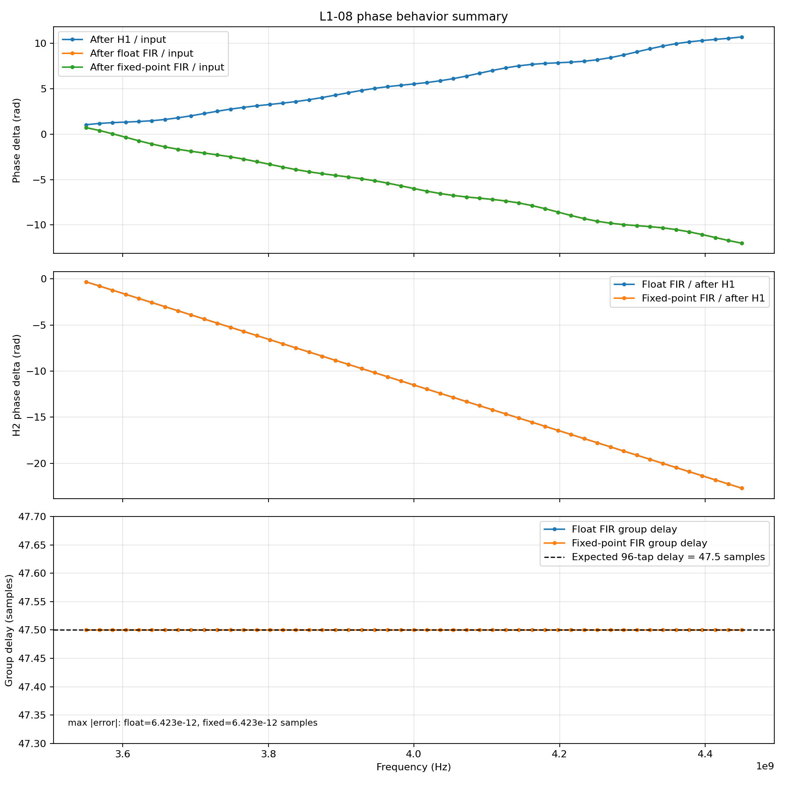
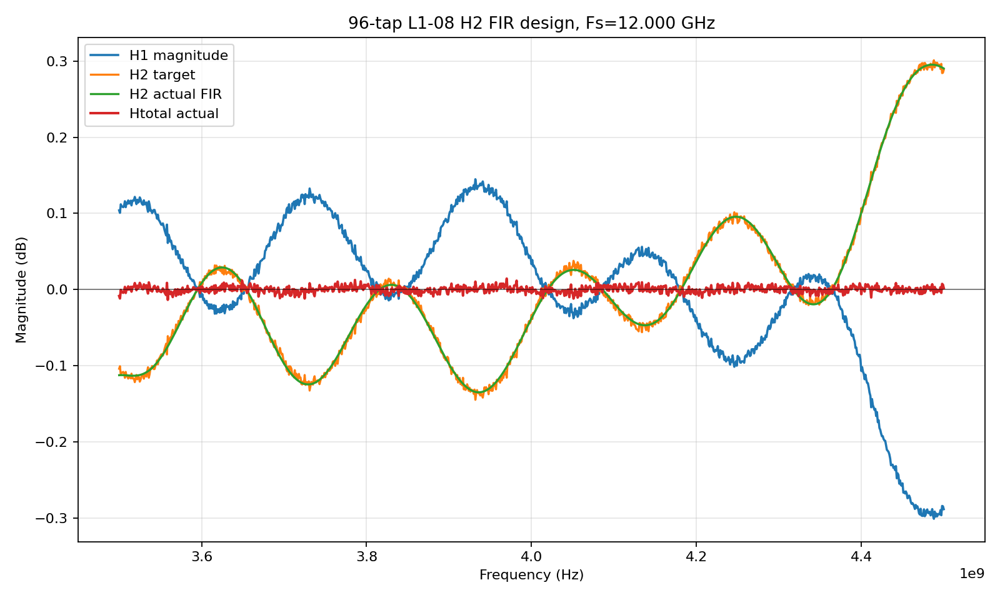
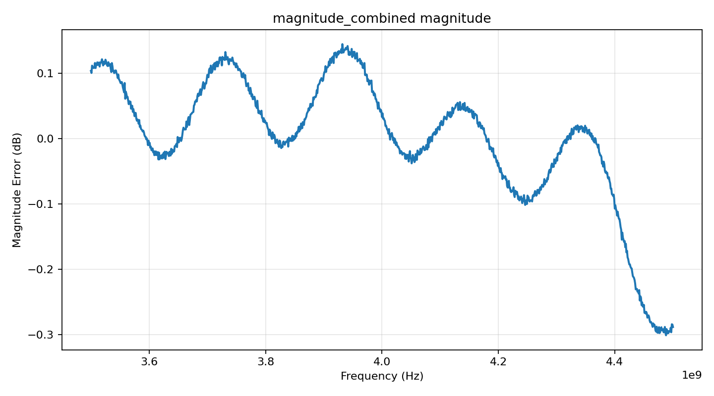
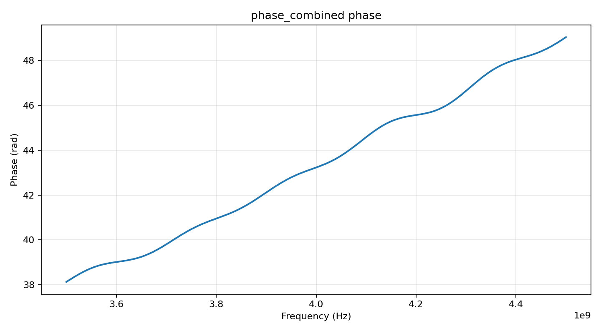
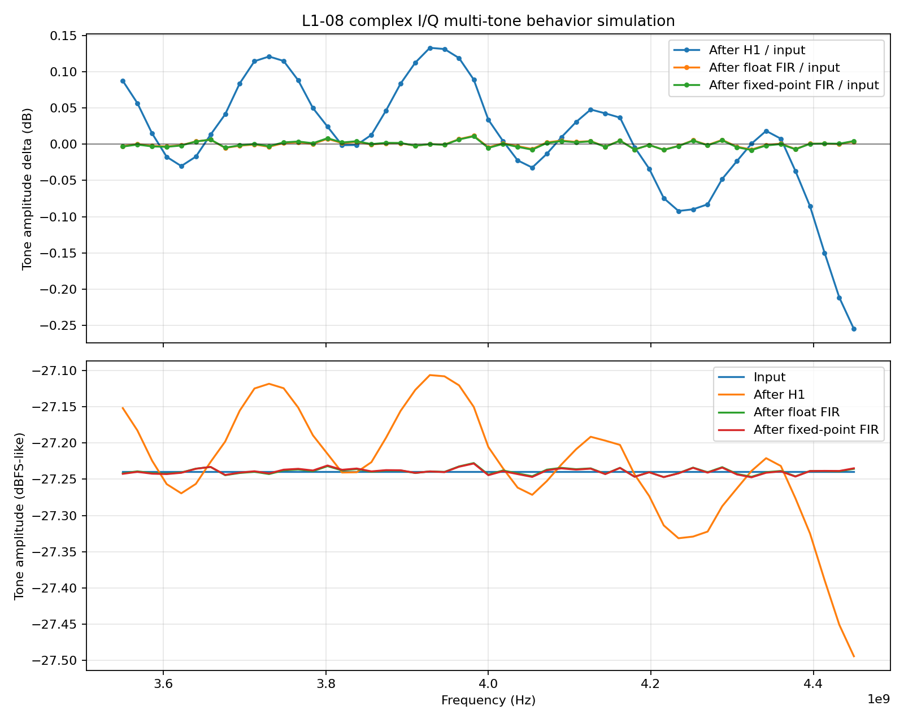
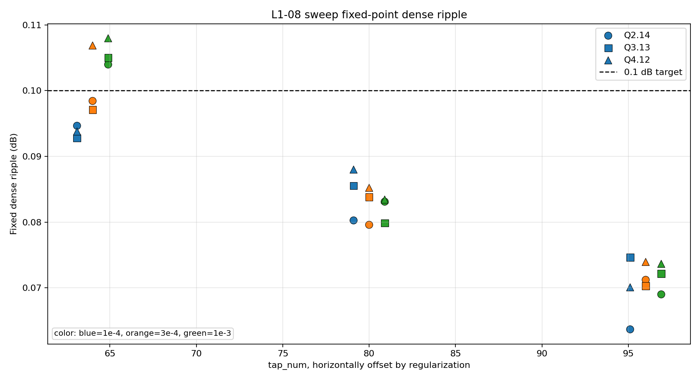
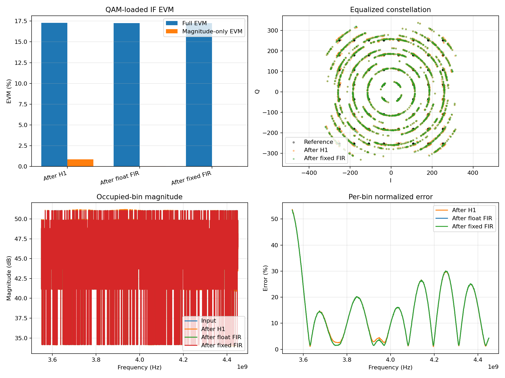

# L1-08 幅频 FIR 均衡算法行为级仿真报告

## 1. 结论

当前程序已经完成了以下核心闭环：

1. 随机生成符合物理直觉的前端幅频/相频失真 `H1`。
2. 根据 `H1` 的 magnitude 生成理想补偿目标 `H2_target`。
3. 用 64/80/96 tap real linear-phase FIR 设计可实现的 `H2_actual`。
4. 对 FIR 系数进行 fixed-point quantization。
5. 用 multi-tone complex I/Q IF 信号做时域卷积验证。
6. 用 QAM-loaded complex I/Q IF 信号做辅助 EVM 验证。
7. 用 sweep test 比较 tap 数、regularization、fixed-point 格式对结果的影响。

当前重要的实验结论有：

1. 对 mild/moderate 的 `H1`，80 tap 或 96 tap 可以把 residual ripple 压到 `0.1 dB` 以内。
2. 96 tap 在当前 sweep 范围内整体最稳健。
3. 对一个较难的随机 `H1` seed，64/80/96 tap 都没有达到 `<= 0.1 dB` 的 dense ripple 目标。
4. 因此，当前程序证明了算法流程是合理且可跑通的，但也诚实暴露出：如果 `H1` 幅频 ripple 太复杂，64 tap 不一定总能满足指标，后续可以考虑更高 tap、更低 regularization、加权 LS、equiripple 设计，或者重新定义更符合实物的 `H1` 随机范围。

---

## 2. 项目背景：L1-08 解决什么问题

### 2.1 来自算法交付物的需求

根目录中的 `03-频谱仪算法栈交付物.html` 描述了 L1-08：

`L1-08 · 幅频 FIR 均衡 [B · 硬件优先/算法辅]`

它的核心问题是：

射频前端链路中存在很多非理想器件，例如：

1. M3 预选滤波器组。
2. cavity / LTCC。
3. 电缆。
4. PCB 走线。
5. 不同频段、衰减档、预选器状态下的通道差异。

这些器件会让通带内的增益不是完全平坦的，而是出现幅度 ripple。也就是同一个 1 GHz 分析带宽内，有些频点被放大多一点，有些频点被放大小一点。

在宽带 QAM 或宽带测量场景中，这种幅频不平坦会表现为 `EVM_LIN` 恶化。

L1-08 的目标不是修镜像，不是修 I/Q imbalance，也不是修相位。它主要解决：

> 通带内 magnitude ripple 太大，导致不同频率成分的幅度不一致。

### 2.2 L1-08 的量化目标

根据算法交付物，L1-08 的关键目标可以概括为：

1. 使用 64-tap FIR 做幅频补偿。
2. 验证方法以多音 multi-tone 为主。
3. 1 GHz 分析带宽内，校正后的幅度 ripple 目标是 `<= 0.1 dB`。
4. `EVM_LIN` 目标从约 `0.20%` 改善到 `<= 0.10%`。

当前程序围绕这两个目标展开：

1. 主线验证：幅度 ripple 是否能压到 `0.1 dB` 以内。
2. 辅助验证：QAM magnitude-only EVM 是否改善。

---

## 3. L1-08 和 L1-09 的关系与区别

### 3.1 L1-08

L1-08 是幅频 FIR 均衡。

它主要补偿 magnitude：

```text
H1 magnitude 不平坦
        ↓
设计 H2 magnitude 作为反向补偿
        ↓
Htotal = H1 * H2 尽量变平
```

L1-08 关心的是：

```text
|Htotal(f)| 是否接近常数
```

### 3.2 L1-09

L1-09 是 group delay / phase 相关补偿。

如果通道的 group delay 不是常数，那么不同频率成分会产生不同时间延迟，信号波形会被拉扯变形。这个问题不是 L1-08 的主目标。

因此：

1. L1-08 拉 magnitude。
2. L1-09 拉 phase / group delay。
3. 两者合起来才是更完整的宽带校正链路。

当前项目专注 L1-08，所以相位图主要用于确认：real linear-phase FIR 本身没有引入非线性相位失真，只引入 constant group delay。

---

## 4. 核心概念解释

### 4.1 什么是 H1

`H1` 表示硬件前端带来的真实通道失真。

在本项目中，`H1` 是一个频域响应：

```text
H1(f) = H1_magnitude(f) * exp(j * H1_phase(f))
```

其中：

1. `H1_magnitude(f)` 表示每个频率点被放大或衰减多少。
2. `H1_phase(f)` 表示每个频率点被旋转多少相位。

可以把 `H1` 理解成硬件本身。

如果没有任何补偿，输入信号经过硬件后就是：

```text
Y1(f) = X(f) * H1(f)
```

### 4.2 什么是 H2

`H2` 表示我们设计出来的 FIR 补偿滤波器。

它的目标是抵消 `H1` 的 magnitude ripple：

```text
H2_target(f) ≈ 1 / |H1(f)|
```

这样：

```text
|H1(f)| * |H2(f)| ≈ 1
```

最终总响应：

```text
Htotal(f) = H1(f) * H2(f)
```

如果 `H2` 设计得很好，那么：

```text
|Htotal(f)| 近似平坦
```

### 4.3 什么是 H2_target

`H2_target` 是理想目标。

它是数学上希望 FIR 达到的频率响应，不一定能被有限 tap FIR 完全实现。

当前程序中：

1. 先读取 `H1` 的 magnitude。
2. 把 dB 转成 linear。
3. 计算反向补偿。
4. 再做归一化，避免整体增益无意义地变大或变小。

直观理解：

```text
如果 H1 在某个频点增益偏高，H2_target 就在这个频点压低。
如果 H1 在某个频点增益偏低，H2_target 就在这个频点抬高。
```

### 4.4 什么是 H2_actual

`H2_actual` 是真实设计出来的 FIR 响应。

因为 FIR 只有有限 tap，例如 64 tap，所以它不可能完全等于 `H2_target`。程序会通过 least squares 方法找到一组 FIR 系数，使 `H2_actual` 尽量接近 `H2_target`。

### 4.5 什么是 Htotal

`Htotal` 是硬件 `H1` 和补偿 FIR `H2` 串起来后的总效果：

```text
Htotal(f) = H1(f) * H2_actual(f)
```

L1-08 的最终目标就是让：

```text
|Htotal(f)| 尽量平
```

所以最关键的图和指标通常是：

```text
Htotal_actual magnitude ripple after FIR
```

---

## 5. 为什么当前使用 complex I/Q IF

### 5.1 当前仿真的信号频段

当前程序中的信号不是 centered baseband，而是 complex I/Q IF。

主要频率设置是：

```text
采样率 Fs = 12 GHz
H1 频率轴 = 3.5 GHz ~ 4.5 GHz
输入信号测试范围 = 3.55 GHz ~ 4.45 GHz
信号中心频率 = 4 GHz
信号带宽约 = 900 MHz
```

这里保留了一点边缘余量：

```text
H1 建模范围：3.5 ~ 4.5 GHz
输入测试范围：3.55 ~ 4.45 GHz
```

这样做是为了避免输入 tone 刚好落在边界点，减少边界插值和滤波器边缘误差的影响。

### 5.2 complex I/Q IF 是什么

complex I/Q 信号可以写成：

```text
x[n] = I[n] + jQ[n]
```

complex I/Q 的好处是可以明确表示正频率和负频率，不像 real signal 那样天然要求频谱正负对称。

### 5.3 为什么不把 1 GHz 放在 0 Hz 两边

如果把目标带宽放在 centered complex baseband，例如：

```text
-500 MHz ~ +500 MHz
```

那么 real FIR 的 magnitude response 一定满足：

```text
|H(+f)| = |H(-f)|
```

这会限制补偿能力，因为如果硬件 `H1` 在 `+f` 和 `-f` 两侧不对称，real FIR 没法分别给两侧不同补偿。

但当前 L1-08 的实际处理位置是在 DDC 前的 IF，所以目标 1 GHz 是：

```text
3.5 GHz ~ 4.5 GHz
```

它整体在正频率一侧，不是 centered at 0 Hz。因此 real FIR 对 `+f/-f` 的对称性质不会直接限制 3.5~4.5 GHz 内的补偿曲线。

---

## 6. 为什么使用 real linear-phase FIR

### 6.1 real FIR

real FIR 的系数是实数：

```text
h[n] 是 real
```

它可以直接对 complex I/Q 信号做卷积：

```text
y[n] = x[n] * h[n]
```

因为 `x[n]` 是 complex，所以实际等价于：

```text
I_out = I_in * h
Q_out = Q_in * h
```

也就是说，I 路和 Q 路使用同一组 real FIR 系数。

### 6.2 linear-phase FIR

linear-phase FIR 的系数满足对称性：

```text
h[n] = h[N - 1 - n]
```

其中 `N` 是 tap 数。

这样 FIR 的相位响应是线性的：

```text
phase(f) = -2π f * delay + 常数
```

线性相位的物理意义是：

```text
所有频率成分都延迟相同的时间
```

### 6.3 constant group delay 是什么

group delay 可以理解成：

> 某个频率成分通过系统后，被延迟了多少个采样点或多少秒。

如果 group delay 是常数，说明所有频率分量一起整体向后移动，不会互相错位。

对于 `N` tap 对称 FIR：

```text
group delay = (N - 1) / 2 samples
```

例如：

```text
64 tap → 31.5 samples
80 tap → 39.5 samples
96 tap → 47.5 samples
```

下面的代表性图把 phase 和 group delay 放在一起。上面两个子图显示 phase 随频率变化，最下面的子图显示 H2 FIR 的 group delay 基本是一条水平线。也就是说，FIR 的 phase 是线性的，它带来的不是频率相关的相位扭曲，而是固定延迟。



### 6.4 当前设计选择

当前项目选择：

```text
real + linear-phase + FIR
```

原因：

1. 符合算法交付物中 64-tap FIR 的方向。
2. 对硬件友好。
3. 主要解决 magnitude ripple。
4. 不主动引入非线性相位失真。
5. phase / group delay 的进一步修复留给 L1-09。

---

## 7. 当前项目文件结构

当前根目录主要结构如下：

```text
Rigol/
├── 03-频谱仪算法栈交付物.html
├── L1-08_algorithm_design_report.md
├── L1-08_planning/
│   └── L1-08.md
├── L1_08_experiment_config.json
├── L1-08_sim/
│   ├── H1_common.py
│   ├── H1_full_combined_random_generator.py
│   ├── H2_target_generator.py
│   ├── H2_fir_designer.py
│   ├── H2_fixed_point_quantizer.py
│   ├── L1_08_behavior_sim.py
│   ├── L1_08_qam_evm_sim.py
│   ├── L1_08_io_utils.py
│   ├── L1_08_signal_utils.py
│   ├── run_all_pipeline.py
│   ├── README_pipeline.md
│   ├── data/
│   └── results/
├── sweep_test/
│   ├── config.json
│   ├── run_sweep.py
│   └── analyze_sweep_results.py
└── sweep_result/
    └── 每次 sweep 的结果文件夹
```

---

## 8. 配置文件：L1_08_experiment_config.json

### 8.1 配置文件的作用

`L1_08_experiment_config.json` 是当前常规 pipeline 的 source of truth。

核心实验会集中从这个 JSON 读取。

### 8.2 common 参数

```json
"common": {
  "fs_hz": 12000000000.0,
  "if_center_hz": 4000000000.0
}
```

含义：

1. `fs_hz = 12 GHz`：数字采样率。
2. `if_center_hz = 4 GHz`：IF 信号中心频率。

采样率要大于最高频率两倍，当前最高 IF 约 4.5 GHz，所以 12 GHz 满足 Nyquist 条件：

```text
Fs / 2 = 6 GHz > 4.5 GHz
```

### 8.3 H1 参数

当前 H1 seed：

```json
"h1": {
  "seed": 286476255
}
```

这个 seed 控制 H1 随机失真的具体形状。

seed 数字大小本身不表示混乱程度。seed 只是随机数发生器的起点。真正决定 H1 多复杂的是 `h1_random_model` 中的幅度、ripple、feature、noise 范围。

### 8.4 h1_random_model 参数

`h1_random_model` 控制随机 H1 如何生成。

频率范围：

```json
"frequency_grid": {
  "freq_min_hz": 3500000000.0,
  "freq_max_hz": 4500000000.0,
  "num_points": 1001
}
```

含义：

1. 在 `3.5 GHz ~ 4.5 GHz` 上建立频率网格。
2. 一共 1001 个频点。
3. 每个频点都会有一个 magnitude 和 phase。

这些点不是时域采样点，而是频域采样点。

### 8.5 H2 FIR 参数

```json
"h2_fir": {
  "tap_num": 64,
  "regularization": 0.0001
}
```

含义：

1. `tap_num`：FIR 系数个数，也就是滤波器长度。
2. `regularization`：ridge 正则化强度，用于防止 least squares 生成过大的不现实系数。

tap 越多，FIR 能拟合越复杂的频响，但硬件资源也越多。

regularization 越大，系数越稳、越小，但补偿能力可能下降。

### 8.6 fixed_point 参数

```json
"fixed_point": {
  "coeff_total_bits": 16,
  "coeff_frac_bits": 13
}
```

含义：

1. `coeff_total_bits = 16`：FIR 系数总 bit 数。
2. `coeff_frac_bits = 13`：小数 bit 数。

这对应 Q 格式：

```text
Q2.13
```

因为 16 bit 中有 1 bit 符号位，13 bit 小数位，剩下 2 bit 用于整数范围。

fixed-point quantization 用于模拟 RTL/硬件实现中系数不能无限精度表示的问题。

### 8.7 behavior 参数

```json
"behavior": {
  "samples": 65536,
  "settle_samples": 256,
  "tone_count": 51,
  "freq_min_hz": 3550000000.0,
  "freq_max_hz": 4450000000.0,
  "peak": 0.8,
  "seed": 1813889189
}
```

含义：

1. `samples`：时域输入信号长度，共 65536 个采样点。
2. `settle_samples`：滤波后前 256 点不用于测量，用于避开 FIR 初始瞬态。
3. `tone_count`：生成 51 个 multi-tone。
4. `freq_min_hz/freq_max_hz`：tone 分布在 3.55~4.45 GHz。
5. `peak = 0.8`：时域信号归一化峰值限制，不是 dB。
6. `seed`：控制 multi-tone 的随机相位。

### 8.8 qam_evm 参数

```json
"qam_evm": {
  "samples": 65536,
  "freq_min_hz": 3550000000.0,
  "freq_max_hz": 4450000000.0,
  "qam_order": 64,
  "peak": 0.8,
  "max_constellation_points": 3000,
  "seed": 417471910
}
```

含义：

1. 使用 64-QAM 星座点。
2. 在 3.55~4.45 GHz 的 FFT bin 上填入随机 QAM 符号。
3. 再通过 IFFT 变成时域 complex I/Q IF 信号。
4. 用它辅助评估 EVM。

---

## 9. 当前 pipeline 总览

常规单次 pipeline 是：

```text
Step 1: 生成随机 H1
Step 2: 根据 H1 magnitude 生成 H2_target
Step 3: 根据 H2_target 设计 float FIR
Step 4: 对 FIR 系数量化 fixed-point
Step 5: multi-tone 行为级时域仿真
Step 6: QAM/EVM 辅助仿真
Step 7: 保存 run_summary.json
```

对应脚本是：

```text
python L1-08_sim/run_all_pipeline.py
```

当前 `run_all_pipeline.py` 负责按顺序调用各个 stage。

下面这张图来自已经完成的 sweep 结果中的一个代表性组合：

```text
seed = h1_533121161_behavior_1688039438_qam_254967343
combo = tap096_reg1em04_q2_14
```

它直观展示了 `H1`、`H2_target`、`H2_actual` 和补偿后的 `Htotal_actual` 之间的关系。读者可以先看这张图理解整个 L1-08 的核心闭环：H1 原本不平，H2 反向补偿，最终 Htotal 尽量变平。



---

## 10. 每个程序的功能说明

### 10.1 H1_common.py

文件：

```text
L1-08_sim/H1_common.py
```

作用：

1. 定义 H1 数据结构。
2. 定义频率网格配置。
3. 提供不同 H1 相关程序共享的基础类。

可以理解为 H1 模块的公共定义文件。

### 10.2 H1_full_combined_random_generator.py

文件：

```text
L1-08_sim/H1_full_combined_random_generator.py
```

作用：

1. 从 `L1_08_experiment_config.json` 读取 H1 seed 和 `h1_random_model`。
2. 在 `3.5~4.5 GHz` 上生成随机 magnitude。
3. 在同一频率轴上生成随机 phase。
4. 输出 magnitude、phase 和 combined CSV。
5. 输出 combined 图。

它模拟的是硬件真实通道 `H1`。

输出到 `data` 的典型文件：

```text
h1_magnitude_combined.csv
h1_phase_combined.csv
h1_together.csv
```

输出到 `results` 的典型图：

```text
magnitude_combined_magnitude.png
phase_combined_phase.png
```

### 10.3 H2_target_generator.py

文件：

```text
L1-08_sim/H2_target_generator.py
```

作用：

1. 读取 `h1_magnitude_combined.csv`。
2. 计算理想反向补偿 `H2_target`。
3. 输出 `h2_target.csv`。
4. 画出 `H1 magnitude`、`H2 target`、理想 `H1*H2_target`。

输出文件：

```text
data/h2_target.csv
results/h2_target.png
```

### 10.4 H2_fir_designer.py

文件：

```text
L1-08_sim/H2_fir_designer.py
```

作用：

1. 读取 `h2_target.csv`。
2. 使用 real linear-phase FIR 结构。
3. 通过 least squares + ridge regularization 设计 FIR 系数。
4. 输出 float FIR coefficients。
5. 计算 `H2_actual_response.csv`。
6. 画 `H1/H2_target/H2_actual/Htotal_actual`。
7. 打印或记录 before/after ripple。

输出文件：

```text
data/h2_fir_coefficients.csv
data/h2_actual_response.csv
results/h2_fir_design.png
```

### 10.5 H2_fixed_point_quantizer.py

文件：

```text
L1-08_sim/H2_fixed_point_quantizer.py
```

作用：

1. 读取 float FIR coefficients。
2. 按 JSON 中的 fixed-point 格式量化。
3. 保持 FIR 对称性。
4. 输出 fixed-point coefficients。
5. 计算 fixed-point FIR 的频率响应。
6. 统计是否 saturation。

输出文件：

```text
data/h2_fir_coefficients_fixed_point.csv
data/h2_fixed_point_response.csv
results/h2_fixed_point_quantization.png
```

### 10.6 L1_08_behavior_sim.py

文件：

```text
L1-08_sim/L1_08_behavior_sim.py
```

作用：

1. 生成 multi-tone complex I/Q IF 输入。
2. 让输入信号经过 H1。
3. 再分别经过 float FIR 和 fixed-point FIR。
4. 在每个 tone 频率处测量幅度变化。
5. 计算 before/after ripple。
6. 画 magnitude 行为图。
7. 画 phase 行为图和 group delay 图。
8. 保存时域/频域验证数据。

这是最贴近算法交付物“多音验证”的主行为级仿真。

典型输出：

```text
data/l1_08_behavior_tone_measurements.csv
data/l1_08_behavior_waveforms.csv
results/l1_08_behavior_multitone.png
results/l1_08_behavior_phase_combined.png
```

### 10.7 L1_08_qam_evm_sim.py

文件：

```text
L1-08_sim/L1_08_qam_evm_sim.py
```

作用：

1. 生成 QAM-loaded complex I/Q IF 输入。
2. 在 3.55~4.45 GHz 的 FFT bins 上放入随机 QAM 星座点。
3. 用 IFFT 得到时域信号。
4. 经过 H1、float FIR、fixed-point FIR。
5. 计算 full EVM 和 magnitude-only EVM。
6. 输出 QAM/EVM 辅助图表。

注意：

这个模块是辅助验证，不是完整通信接收机。它没有做完整同步、均衡、解调、判决链路。对 L1-08 来说，更应该关注 magnitude-only EVM，因为 L1-08 只负责幅度。

### 10.8 L1_08_io_utils.py

文件：

```text
L1-08_sim/L1_08_io_utils.py
```

作用：

提供通用 IO 函数，例如：

1. 读取配置。
2. 找到项目根目录。
3. 管理 `data` 和 `results` 路径。
4. 保存 summary。

它的目的是减少每个脚本里重复写路径处理代码。

### 10.9 L1_08_signal_utils.py

文件：

```text
L1-08_sim/L1_08_signal_utils.py
```

作用：

提供信号处理相关公共函数，例如：

1. 生成 multi-tone。
2. 生成 QAM 符号。
3. 应用频域 H1。
4. 对 complex I/Q 信号做 FIR 卷积。
5. 计算 tone 幅度和相位。

它让行为级仿真和 QAM/EVM 仿真共享同一套底层工具。

### 10.10 run_all_pipeline.py

文件：

```text
L1-08_sim/run_all_pipeline.py
```

作用：

一键按顺序运行整个常规 pipeline。

命令：

```powershell
python L1-08_sim/run_all_pipeline.py
```

它会自动执行：

```text
H1 generator
H2 target generator
H2 FIR designer
H2 fixed-point quantizer
behavior simulation
QAM/EVM simulation
run summary generation
```

---

## 11. 数学原理

### 11.1 dB 和 linear 的关系

幅度 dB 与 linear 幅度之间的关系是：

```text
mag_db = 20 * log10(mag_linear)
mag_linear = 10^(mag_db / 20)
```

如果某个频点 `H1 = +0.2 dB`，说明它被略微放大。

如果某个频点 `H1 = -0.2 dB`，说明它被略微压低。

L1-08 希望通过 `H2` 把这些不平坦抵消掉。

### 11.2 H2_target 的计算

假设硬件幅度响应是：

```text
M1(f) = |H1(f)|
```

理想补偿是：

```text
M2_target(f) = 1 / M1(f)
```

这样：

```text
Mtotal(f) = M1(f) * M2_target(f) = 1
```

实际程序会做归一化，避免整体增益偏移影响指标。因为 L1-08 主要关心 ripple，不关心整体 gain 是多少。

### 11.3 real symmetric FIR 的频率响应

FIR 的时域卷积是：

```text
y[n] = Σ h[k] x[n-k]
```

频域对应：

```text
Y(f) = X(f) H(f)
```

如果 FIR 系数对称：

```text
h[n] = h[N-1-n]
```

那么：

```text
H(ω) = exp(-jωD) A(ω)
```

其中：

```text
D = (N - 1) / 2
```

`A(ω)` 是实数幅度函数，`exp(-jωD)` 是纯延迟项。

这说明：

1. FIR 的 magnitude 由 `A(ω)` 决定。
2. FIR 的 phase 是线性的。
3. FIR 的 group delay 是常数 `D`。

### 11.4 LS(最小二乘法)

在本项目里，它的意思是：

> 找一组 FIR 系数，让 FIR 在所有频点上的响应和 `H2_target` 的误差平方和最小。

如果用公式写：

```text
minimize Σ |H2_actual(f_i) - H2_target(f_i)|^2
```

因为 real linear-phase FIR 可以写成 cosine basis 的形式，所以问题可以变成矩阵形式：

```text
minimize ||A c - b||^2
```

其中：

1. `A` 是由频率点和 cosine basis 组成的矩阵。
2. `c` 是要求解的半边 FIR 系数。
3. `b` 是目标响应 `H2_target`。

### 11.5 ridge regularization 是什么

如果只做无约束 LS，有时会出现 FIR 系数特别大、正负剧烈抵消的情况。

这在数学上可能拟合得很好，但硬件上不现实：

1. 系数动态范围太大。
2. fixed-point 量化容易 saturation。
3. 对噪声和误差敏感。
4. 实际实现不稳定。

因此程序加入 ridge regularization：

```text
minimize ||A c - b||^2 + λ ||c||^2
```

其中 `λ` 就是 JSON 里的 `regularization`。

直观理解：

1. 第一项要求拟合 `H2_target`。
2. 第二项惩罚过大的系数。
3. `λ` 越大，系数越保守，但拟合误差可能更大。

当前常规值是：

```text
regularization = 1e-4
```

### 11.6 fixed-point quantization 的数学含义

float FIR 系数是无限精度近似，例如：

```text
h = 0.123456789
```

硬件中不能直接使用无限精度小数，只能用固定 bit 表示。

如果使用 `Q2.13`：

```text
scale = 2^13 = 8192
```

量化过程大致是：

```text
q_int = round(h_float * 8192)
h_quantized = q_int / 8192
```

如果 `q_int` 超出 16-bit 有符号范围，就会 saturation。

当前 sweep 中的 fixed-point 格式包括：

```text
Q2.14
Q3.13
Q4.12
```

它们的区别是：

1. 小数 bit 越多，精度越高。
2. 整数 bit 越多，动态范围越大。
3. 如果系数较大，整数 bit 不够就会 saturation。
4. 如果系数较小，小数 bit 不够就会量化误差变大。

---

## 12. H1 随机生成模型

### 12.1 为什么要随机生成 H1

真实硬件前端的幅频响应不是一条完美直线。不同机器、不同频段、不同衰减档、不同预选器状态都会有差异。

因此行为级仿真不能只测一个固定曲线，而应该生成多种可能的 H1，观察算法是否稳健。

当前程序通过随机组合以下因素生成 H1 magnitude：

1. 整体 slope。
2. 正弦 ripple。
3. 局部 notch / bump。
4. edge rolloff。
5. measurement noise。

phase 则通过以下因素生成：

1. 线性相位延迟。
2. phase ripple。
3. 局部 phase distortion。
4. group delay ripple。
5. phase noise。

### 12.2 H1 magnitude 随机因素

当前 JSON 中的主要范围如下：

| 随机因素 | 含义 | 当前范围 |
|---|---|---|
| slope | 整个 1 GHz 内的缓慢倾斜 | `0 ~ 0.4 dB peak-to-peak` |
| offset | 整体 gain 偏移 | `-0.02 ~ +0.02 dB` |
| ripple component count | 正弦 ripple 数量 | `1 ~ 4` |
| ripple amplitude | 每个 ripple 幅度 | `0.02 ~ 0.12 dB` |
| ripple cycles | ripple 在频带内振荡次数 | `0.5 ~ 5` |
| notch/bump count | 局部凹陷/凸起数量 | `1 ~ 4` |
| notch/bump amplitude | 局部特征幅度 | `0.05 ~ 0.35 dB` |
| edge rolloff depth | 边缘 rolloff 深度 | `0.05 ~ 0.35 dB` |
| measurement noise | 测量噪声 | `0.002 ~ 0.01 dB` |

这些设置总体上是符合滤波器、PCB、线缆、预选器等硬件链路幅频 ripple 的物理直觉的。

### 12.3 H1 phase 随机因素

当前 phase 也会被随机生成，但 L1-08 不主动修 phase。

phase 的作用主要是：

1. 让行为级仿真更接近真实 complex channel。
2. 验证 FIR 补偿不会额外引入非线性相位。
3. 为后续 L1-09 group delay 补偿留下合理输入。

下面两张图展示了同一个代表性 run 中随机生成的 `H1`。第一张是 magnitude，第二张是 phase。它们说明当前 H1 不是一条简单直线，而是包含 slope、ripple、局部起伏和相位扰动的综合硬件近似模型。





---

## 13. 输入信号模型

当前程序使用两种时域输入：

1. multi-tone input。
2. QAM-loaded input。

两者本质上都是 complex I/Q IF 信号。

区别在于频域内容不同。

### 13.1 multi-tone input

multi-tone 的意思是：

> 同时生成多个离散频率的正弦 tone，并把它们叠加起来。

当前行为级仿真中：

```text
tone_count = 51
freq range = 3.55 GHz ~ 4.45 GHz
```

也就是在目标频带内放 51 个测试频点。

multi-tone 的优点：

1. 很容易测每个频点的幅度。
2. 很容易看补偿前后 ripple。
3. 和算法交付物中的多音验证方法一致。
4. 适合做 L1-08 主验证。

multi-tone 的局限：

1. 只测 51 个频点。
2. 如果某个尖锐 ripple 刚好不在 tone 上，可能测不到最坏情况。

因此 sweep 中还需要 dense ripple 指标，用 1001 个频点更严格地评估频响。

下面这张图是 multi-tone 行为级仿真的代表性结果。它同时显示补偿前的 tone 幅度起伏，以及 float FIR / fixed-point FIR 补偿后的幅度起伏。读图时重点看补偿后的曲线是否压到 0 dB 附近，以及 residual ripple 是否小于 `0.1 dB`。



### 13.2 QAM-loaded input

QAM 是 Quadrature Amplitude Modulation，正交幅度调制。

QAM 星座点是复数：

```text
a + bj
```

64-QAM 表示星座图中有 64 种可能的复数点。

当前 QAM/EVM 模块的生成方式是：

1. 找到 `3.55~4.45 GHz` 内的 FFT bins。
2. 在这些 bins 上填入随机 64-QAM 星座点。
3. 对频域数组做 IFFT。
4. 得到时域 complex I/Q IF 信号。

这里的一个 bin 可以理解为 FFT 频率轴上的一个小频率格子，不是 64 个点。64-QAM 的 64 指的是星座点种类，不是一个 bin 里装 64 个点。

QAM input 的优点：

1. 更接近宽带调制信号。
2. 可以辅助观察 EVM。
3. 能更贴近算法交付物中提到的宽带 QAM 场景。

QAM input 的局限：

1. 当前不是完整通信接收机。
2. full EVM 会同时受到 magnitude 和 phase/group delay 影响。
3. L1-08 只修 magnitude，所以不应该把 full EVM 当作唯一 L1-08 指标。

---

## 14. 验证指标

### 14.1 H1 ripple before

表示原始硬件 H1 的 magnitude ripple。

计算方式可以理解为：

```text
ripple = max(magnitude_db) - min(magnitude_db)
```

它越大，说明硬件幅频越不平。

### 14.2 dense fixed ripple after

这是最严格、最直接的 L1-08 频域指标。

它在 H1 的 dense frequency grid 上计算：

```text
|H1(f) * H2_fixed(f)|
```

然后看 3.5~4.5 GHz 或目标分析带宽内的 ripple。

它不依赖某个具体输入信号，而是直接由 H1 和 H2 决定。

因此：

```text
best_fixed_dense
```

可以理解为“只从频响本身看，哪个组合补得最好”。

### 14.3 behavior ripple after

这是 multi-tone 时域仿真指标。

它依赖实际生成的 input signal：

1. 输入 51 个 tone。
2. 经过 H1。
3. 再经过 FIR。
4. 测量每个 tone 的输出幅度。
5. 计算这些 tone 的幅度 ripple。

它比 dense ripple 更接近行为级仿真，但因为只有 51 个 tone，可能漏掉 dense grid 上的最坏点。

因此：

```text
best_behavior_fixed
```

可以理解为“对当前 multi-tone 输入，哪个组合表现最好”。

### 14.4 QAM EVM

EVM 是 Error Vector Magnitude，误差向量幅度。

它衡量输出星座点和理想星座点之间的距离。

当前程序里有两类 EVM：

1. full EVM。
2. magnitude-only EVM。

对 L1-08 来说，更应该看 magnitude-only EVM，因为 L1-08 的目标是幅度补偿。

full EVM 还包含 phase 和 group delay 影响，因此它可能需要 L1-09 才能进一步改善。

### 14.5 pass/fail 标准

当前报告中最核心的 pass/fail 标准是：

```text
residual ripple <= 0.1 dB
```

这对应算法交付物里对 1 GHz 分析带宽通带幅度起伏的目标。

---

## 15. 常规单次运行会输出什么

如果运行：

```powershell
python L1-08_sim/run_all_pipeline.py
```

结果会输出到：

```text
L1-08_sim/data/
L1-08_sim/results/
```

### 15.1 data 文件夹

`data` 里主要保存 `.csv` 和 `.json` 数据，适合后续分析或 RTL golden reference。

典型文件包括：

| 文件 | 含义 |
|---|---|
| `h1_magnitude_combined.csv` | H1 magnitude 频域响应 |
| `h1_phase_combined.csv` | H1 phase 频域响应 |
| `h1_together.csv` | H1 magnitude + phase 合并表 |
| `h2_target.csv` | 理想补偿目标 |
| `h2_fir_coefficients.csv` | float FIR 系数 |
| `h2_actual_response.csv` | float FIR 频率响应 |
| `h2_fir_coefficients_fixed_point.csv` | fixed-point FIR 系数 |
| `h2_fixed_point_response.csv` | fixed-point FIR 频率响应 |
| `l1_08_behavior_tone_measurements.csv` | multi-tone 每个 tone 的测量结果 |
| `l1_08_behavior_waveforms.csv` | 行为级仿真中的时域波形 |
| `l1_08_qam_evm_summary.csv` | QAM/EVM summary |
| `run_summary.json` | 当前 run 的关键参数和指标摘要 |

### 15.2 results 文件夹

`results` 里保存 `.png` 图

典型图包括：

| 图 | 含义 |
|---|---|
| `magnitude_combined_magnitude.png` | 随机 H1 magnitude |
| `phase_combined_phase.png` | 随机 H1 phase |
| `h2_target.png` | H2 target 生成效果 |
| `h2_fir_design.png` | H1、H2_target、H2_actual、Htotal 对比 |
| `h2_fixed_point_quantization.png` | fixed-point FIR 系数量化和频响 |
| `l1_08_behavior_multitone.png` | multi-tone 幅度补偿前后 |
| `l1_08_behavior_phase_combined.png` | phase 和 group delay 总结 |
| `l1_08_qam_evm.png` | QAM/EVM 辅助验证图 |

---

## 16. sweep test 设计

### 16.1 为什么要做 sweep

单次运行只能说明一个参数组合是否可行。

但实际算法设计需要回答：

1. 64 tap 够不够。
2. 80 tap 或 96 tap 是否明显更好。
3. regularization 选多少合适。
4. fixed-point 格式是否会破坏补偿效果。
5. 不同随机 H1 下算法是否稳健。

因此需要 sweep test。

### 16.2 sweep 参数

当前 sweep 只
关注三个核心变量：

```text
tap_num: 64, 80, 96
regularization: 1e-4, 3e-4, 1e-3
fixed-point format: Q2.14, Q3.13, Q4.12
```

组合数：

```text
3 tap choices * 3 regularization choices * 3 fixed-point choices = 27 combos
```

每一个 seed 跑一次 sweep，会生成 27 个 result folder。

### 16.3 sweep 代码位置

sweep 程序位于：

```text
sweep_test/run_sweep.py
```

sweep 配置位于：

```text
sweep_test/config.json
```

sweep 结果输出到：

```text
sweep_result/
```

### 16.4 sweep 输出结构

每一次 seed sweep 会生成一个文件夹，例如：

```text
sweep_result/h1_1366789340_behavior_1224877734_qam_1756070480/
```

里面包含：

```text
sweep_summary.csv
sweep_analysis_report.md
sweep_best_combos.csv
sweep_group_summary.csv
sweep_fixed_dense_ripple_by_tap.png
sweep_behavior_ripple_by_tap.png
sweep_qam_evm_by_tap.png
sweep_saturation_and_coeff_range.png
tap064_reg1em04_q2_14/
tap064_reg1em04_q3_13/
...
tap096_reg1em03_q4_12/
```

每个 combo folder 里又有：

```text
data/
results/
logs/
```

这些内容和常规 pipeline 的输出格式一致。

---

## 17. sweep_summary.csv 包含什么

每个 seed folder 中的 `sweep_summary.csv` 是这一轮 sweep 的总表。

它通常包含：

1. 当前 combo 的 tap 数。
2. 当前 combo 的 regularization。
3. 当前 combo 的 fixed-point bit 格式。
4. H1 原始 ripple。
5. float FIR dense ripple。
6. fixed-point FIR dense ripple。
7. behavior ripple。
8. QAM/EVM 相关指标。
9. fixed-point 是否 saturation。
10. 系数范围。
11. pass/fail 状态。

可以把它理解为：

> 这一轮 27 个实验的总成绩表。

---

## 18. analyze_sweep_results.py 做什么

文件：

```text
sweep_test/analyze_sweep_results.py
```

作用：

1. 读取每个 seed folder 里的 `sweep_summary.csv`。
2. 按不同 criterion 选出最佳 combo。
3. 按 tap 数分组统计 pass 数和平均表现。
4. 画 sweep 分析图。
5. 输出 markdown 分析报告。

输出文件包括：

```text
sweep_analysis_report.md
sweep_best_combos.csv
sweep_group_summary.csv
sweep_fixed_dense_ripple_by_tap.png
sweep_behavior_ripple_by_tap.png
sweep_qam_evm_by_tap.png
sweep_saturation_and_coeff_range.png
```

这些文件和 `sweep_summary.csv` 在同一级目录。

---

## 19. sweep criterion 解释

sweep 分析中出现的 criterion 含义如下。

### 19.1 best_fixed_dense

不看具体时域输入，只看 dense frequency grid 上：

```text
H1 * H2_fixed
```

哪个 combo 的 residual ripple 最小。

这是最直接的频域补偿效果指标。

### 19.2 best_fixed_dense_unsaturated

和 `best_fixed_dense` 类似，但要求 fixed-point 系数没有 saturation。

如果某个 combo ripple 很好但系数量化已经 saturation，则硬件上风险较大。

### 19.3 best_behavior_fixed

看 multi-tone 时域仿真中，fixed-point FIR 后的 tone amplitude ripple 哪个最小。

它依赖当前输入 tone 的分布和相位。

### 19.4 best_behavior_fixed_unsaturated

和 `best_behavior_fixed` 类似，但要求 fixed-point 没有 saturation。

### 19.5 best_qam_fixed

看 QAM-loaded 输入下 fixed-point FIR 的 QAM/EVM 指标哪个最好。

这个是辅助指标，不是 L1-08 最核心 pass/fail 指标。

### 19.6 best_qam_fixed_unsaturated

和 `best_qam_fixed` 类似，但要求 fixed-point 没有 saturation。

### 19.7 lowest_tap_dense_pass

在 dense ripple 满足 `<= 0.1 dB` 的组合里，找 tap 数最小的。

这个 criterion 用来回答：

> 如果只想满足指标，最少需要多少 tap？

### 19.8 lowest_tap_behavior_pass

在 multi-tone behavior ripple 满足 `<= 0.1 dB` 的组合里，找 tap 数最小的。

---

## 20. 已完成的三轮 sweep 实验

当前已经完成三轮 seed sweep。

每轮 sweep 都跑了 27 个 combo。

总实验数量：

```text
3 seeds * 27 combos = 81 runs
```

三轮 seed 分别是：

| Sweep | H1 seed | behavior seed | QAM seed |
|---|---:|---:|---:|
| Seed 1 | 1366789340 | 1224877734 | 1756070480 |
| Seed 2 | 286476255 | 1813889189 | 417471910 |
| Seed 3 | 533121161 | 1688039438 | 254967343 |

对应结果目录：

```text
sweep_result/h1_1366789340_behavior_1224877734_qam_1756070480/
sweep_result/h1_286476255_behavior_1813889189_qam_417471910/
sweep_result/h1_533121161_behavior_1688039438_qam_254967343/
```

---

## 21. 三轮 sweep 总体结果

### 21.1 每个 seed 的总体结果

| Seed folder | H1 ripple before | dense pass | behavior pass | saturated combos | best dense combo | best dense ripple | best behavior ripple | best QAM EVM |
|---|---:|---:|---:|---:|---|---:|---:|---:|
| `h1_1366789340_behavior_1224877734_qam_1756070480` | 0.635 dB | 23/27 | 27/27 | 0 | `tap096_reg1em04_q2_14` | 0.064 dB | 0.045 dB | 0.104% |
| `h1_286476255_behavior_1813889189_qam_417471910` | 0.758 dB | 0/27 | 0/27 | 0 | `tap096_reg3em04_q4_12` | 0.142 dB | 0.137 dB | 0.264% |
| `h1_533121161_behavior_1688039438_qam_254967343` | 0.446 dB | 15/27 | 20/27 | 0 | `tap096_reg1em04_q2_14` | 0.028 dB | 0.019 dB | 0.043% |

下面三张图分别对应三轮 seed sweep 的 dense ripple 结果。它们能直观看出 tap 数增加后 residual ripple 通常下降，同时也能看出 Seed 2 是当前最难的一组，96 tap 仍然没有全部压到 `0.1 dB` 以下。




### 21.2 结果解读

Seed 1：

1. 原始 H1 ripple 约 `0.635 dB`。
2. 绝大多数 combo 可以通过 dense ripple。
3. 所有 combo 都通过 behavior ripple。
4. 96 tap 最好。

Seed 2：

1. 原始 H1 ripple 约 `0.758 dB`，是三轮中最难的一组。
2. 所有 27 个 combo 都没有达到 dense `<=0.1 dB`。
3. 所有 27 个 combo 也没有达到 behavior `<=0.1 dB`。
4. 96 tap 仍然是最好，但 best dense 仍然约 `0.142 dB`。
5. 说明当前 64/80/96 tap + 当前 LS/ridge 范围，对某些复杂 H1 仍然不足。

Seed 3：

1. 原始 H1 ripple 约 `0.446 dB`。
2. 80 tap 和 96 tap 表现明显优于 64 tap。
3. 96 tap 可以达到很好的补偿效果。

---

## 22. 按 tap 数汇总的结果

### 22.1 Seed 1

| Tap | dense pass | behavior pass | best dense ripple | best QAM EVM |
|---:|---:|---:|---:|---:|
| 64 | 5/9 | 9/9 | 0.093 dB | 0.156% |
| 80 | 9/9 | 9/9 | 0.080 dB | 0.130% |
| 96 | 9/9 | 9/9 | 0.064 dB | 0.104% |

结论：

Seed 1 下，64 tap 已经有部分组合可过，80/96 tap 更稳。

### 22.2 Seed 2

| Tap | dense pass | behavior pass | best dense ripple | best QAM EVM |
|---:|---:|---:|---:|---:|
| 64 | 0/9 | 0/9 | 0.191 dB | 0.370% |
| 80 | 0/9 | 0/9 | 0.156 dB | 0.298% |
| 96 | 0/9 | 0/9 | 0.142 dB | 0.264% |

结论：

Seed 2 是当前最关键的反例。即使 96 tap 也没有达到 `0.1 dB`。这说明程序不是只报好结果，而是能暴露当前设计能力边界。

### 22.3 Seed 3

| Tap | dense pass | behavior pass | best dense ripple | best QAM EVM |
|---:|---:|---:|---:|---:|
| 64 | 0/9 | 2/9 | 0.125 dB | 0.351% |
| 80 | 6/9 | 9/9 | 0.054 dB | 0.141% |
| 96 | 9/9 | 9/9 | 0.028 dB | 0.043% |

结论：

Seed 3 下，64 tap 不够，80 tap 基本可用，96 tap 很稳。

### 22.4 三轮聚合结果

| Tap | dense pass | behavior pass | average fixed dense ripple | best dense ripple | best QAM EVM |
|---:|---:|---:|---:|---:|---:|
| 64 | 5/27 | 11/27 | 0.144 dB | 0.093 dB | 0.156% |
| 80 | 15/27 | 18/27 | 0.108 dB | 0.054 dB | 0.130% |
| 96 | 18/27 | 18/27 | 0.084 dB | 0.028 dB | 0.043% |

总体趋势非常清楚：

```text
96 tap > 80 tap > 64 tap
```

tap 越多，平均 residual ripple 越低，pass 数越多。

---

## 23. 最优组合观察

跨三轮 seed 看，表现最好的组合之一是：

```text
tap096_reg1em04_q2_14
```

它的聚合表现：

| 指标 | 数值 |
|---|---:|
| dense pass | 2/3 |
| behavior pass | 2/3 |
| average dense ripple | 0.079 dB |
| max dense ripple | 0.145 dB |
| average behavior ripple | 0.068 dB |
| average QAM EVM | 0.137% |
| max QAM EVM | 0.264% |
| saturation | 0 |

它不是所有 seed 都 pass，因为 Seed 2 太难。

但它在当前 sweep 范围内是非常有竞争力的组合：

1. 96 tap 带来更强拟合能力。
2. `regularization=1e-4` 让拟合比较积极。
3. `Q2.14` 小数位最多，量化精度较高。
4. 当前三轮里没有 saturation。

---

## 24. dense ripple 和 behavior ripple 的不同

### 24.1 dense ripple

dense ripple 是直接在频率响应上算的。

它使用 H1 的 1001 个频率点。

它回答：

> 如果看完整频带的频响，补偿后最坏 ripple 是多少？

### 24.2 behavior ripple

behavior ripple 是通过时域 multi-tone 信号测出来的。

它只在 51 个 tone 上测量。

它回答：

> 对当前这个 multi-tone 输入，输出 tone 的幅度平不平？

### 24.3 为什么 behavior 可能比 dense 好

因为 51 个 tone 不一定刚好采到最坏频点。

如果 Htotal 中有一个局部尖峰，但 tone 没落在那里，那么 behavior ripple 可能看起来更好。

因此：

1. dense ripple 更严格。
2. behavior ripple 更贴近行为级输入输出验证。
3. 两者都应该保留。
4. 报告中主 pass/fail 应优先看 dense ripple，再用 behavior ripple 做佐证。

下面这张 behavior sweep 图展示了同一组 Seed 3 下，multi-tone 行为级结果随 tap 数变化的趋势。它和 dense ripple 图通常方向一致，但数值不一定完全相同，因为 behavior 只测有限个 tone。


---

## 25. fixed-point 结果解读

当前三轮 sweep 中：

```text
saturated combos = 0
```

这说明在当前 H1、tap、regularization、fixed-point 格式范围内，系数量化没有发生溢出饱和。

这很重要，因为：

1. 如果 float FIR 很好，但 fixed-point 后 saturation，硬件不可用。
2. 当前结果说明 fixed-point 格式至少在这三轮中没有明显动态范围问题。

但是 fixed-point 仍然会带来量化误差。

一般来说：

1. `Q2.14` 精度最高，但整数范围较小。
2. `Q3.13` 平衡范围和精度。
3. `Q4.12` 范围更大，但小数精度较低。

当前未发生 saturation 时，通常小数位更多的格式可能更有利。

下面这张图来自 Seed 3 的 sweep 分析，展示不同组合下的 fixed-point saturation 情况和系数范围。它的作用是确认：补偿效果不能只看 ripple，还要确认系数是否落在硬件定点格式能表示的范围内。


---

## 26. QAM/EVM 模块应该如何看

### 26.1 它不是主判据

当前 QAM/EVM 模块是最小可用版本，用于辅助展示宽带调制信号通过 H1 和 FIR 后的误差变化。

它不应该替代 dense ripple 和 multi-tone behavior。

下面这张图是代表性 combo 的 QAM/EVM 辅助验证图。它适合用来说明：同样是 complex I/Q IF 输入，QAM-loaded input 更接近宽带调制信号；但 L1-08 的主目标仍然是 magnitude ripple，不是完整通信链路 EVM。



### 26.2 full EVM 和 EVM_LIN 不完全一样

算法交付物提到的是 `EVM_LIN`，重点与 magnitude 误差相关。

当前程序的 full EVM 会包含：

1. magnitude error。
2. phase error。
3. group delay 影响。
4. 当前简化 QAM/IFFT 模型的误差。

所以 full EVM 不能直接等同于 L1-08 目标中的 `EVM_LIN`。

更合理的对应方式是：

```text
L1-08 主要看 magnitude-only EVM 或 residual magnitude ripple
```

### 26.3 为什么还保留 QAM/EVM

因为它有价值：

1. 它比 multi-tone 更像宽带调制信号。
2. 它能帮助解释幅频 ripple 对 QAM 星座的影响。
3. 它能作为后续 L1-09 或完整链路仿真的基础。

下面这张 sweep 图展示 QAM/EVM 指标随 tap 数和组合变化的趋势。它可以作为辅助 tradeoff 图，但不应替代 dense ripple 作为 L1-08 的主判据。


---

## 27. 如何从零运行当前项目

### 27.1 单次 pipeline

在 PowerShell 中进入项目根目录：

```powershell
cd D:\桌面\Rigol
```

运行：

```powershell
python L1-08_sim/run_all_pipeline.py
```

运行完成后查看：

```text
L1-08_sim/data/
L1-08_sim/results/
```

### 27.2 单次 sweep

先确认：

```text
sweep_test/config.json
```

然后运行：

```powershell
python sweep_test/run_sweep.py
```

它会在 `sweep_result` 中生成一个以 seed 命名的新文件夹。

### 27.3 分析 sweep

运行：

```powershell
python sweep_test/analyze_sweep_results.py
```

它会在当前 sweep result folder 中生成：

```text
sweep_analysis_report.md
sweep_best_combos.csv
sweep_group_summary.csv
*.png
```

---

## 28. 当前最重要的工程结论

### 28.1 96 tap 是当前 sweep 中最稳健选择

从三轮 seed 聚合结果看：

1. 96 tap 平均 dense ripple 最低。
2. 96 tap best QAM EVM 最好。
3. 96 tap 在 mild/moderate H1 下表现很好。

因此如果不只局限于交付物中的 64 tap baseline，而是允许权衡硬件资源，96 tap 是当前更稳健的选择。

### 28.2 64 tap 不一定足够

虽然交付物中写的是 64-tap FIR，但当前随机模型显示：

1. 对某些 H1，64 tap 可以过。
2. 对更复杂的 H1，64 tap 不够。
3. 甚至 96 tap 也可能不够。

```text
在当前 H1 随机模型下，64 tap 对部分场景可满足目标，但鲁棒性不足；80/96 tap 明显提升补偿能力，其中 96 tap 最稳健。
```

### 28.3 H1 随机模型需要和真实硬件数据对齐

当前 H1 是人为随机生成的物理近似模型，不是真实 VNA 数据。

所以如果后续拿到真实硬件数据，应该：

1. 用真实 VNA / NVM 表替代随机 H1。
2. 重新跑同样 pipeline。
3. 用真实 pass/fail 判断 64 tap 是否足够。

当前随机 H1 的意义是：

1. 提前验证算法流程。
2. 暴露设计能力边界。
3. 为 RTL 前的行为级仿真提供可控数据。

---

## 29. 术语表

| 术语 | 含义 |
|---|---|
| FIR | Finite Impulse Response，有限冲激响应滤波器 |
| tap | FIR 系数个数 |
| H1 | 硬件前端通道响应 |
| H2 | 数字 FIR 补偿响应 |
| H2_target | 理想补偿目标 |
| H2_actual | 实际 FIR 实现的补偿响应 |
| Htotal | `H1 * H2` 的总响应 |
| ripple | 通带内最大值和最小值的差 |
| dB | 对数幅度单位 |
| complex I/Q | 用 `I + jQ` 表示的复数信号 |
| IF | Intermediate Frequency，中频 |
| baseband | 基带，通常围绕 0 Hz |
| DDC | Digital Down Conversion，数字下变频 |
| NCO | Numerically Controlled Oscillator，数字本振 |
| group delay | 群延时，不同频率成分的时间延迟 |
| constant group delay | 所有频率成分延迟相同 |
| LS | Least Squares，最小二乘 |
| ridge | 正则化方法，用于限制系数过大 |
| fixed-point | 定点数，硬件中常用的有限 bit 表示 |
| saturation | 定点值超出范围后被夹到最大/最小 |
| QAM | 正交幅度调制 |
| EVM | Error Vector Magnitude，误差向量幅度 |
| dense ripple | 在密集频率点上直接算的 ripple |
| behavior ripple | 通过时域 multi-tone 输入测得的 ripple |

---

## 30. 最终结论

当前 L1-08 行为级仿真程序已经形成完整闭环：

```text
H1 随机硬件模型
→ H2 target
→ real linear-phase FIR 设计
→ fixed-point 系数量化
→ multi-tone 时域验证
→ QAM/EVM 辅助验证
→ sweep 参数评估
→ 自动分析报告
```
当前行为级仿真验证了 L1-08 幅频 FIR 均衡流程的可行性，并证明 real linear-phase FIR 能有效降低通带 magnitude ripple；在当前随机 H1 模型下，80/96 tap 对多数场景可达到 `0.1 dB` 目标，其中 96 tap 最稳健。但 64 tap 不是所有随机 H1 下都能保证满足目标，后续需要结合真实 VNA 数据或扩大 tap/优化设计方法进一步分析。
