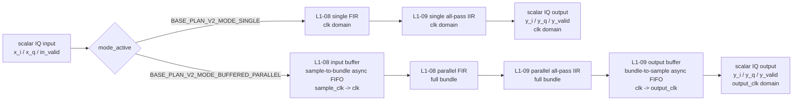

# RTL Design V2 Architecture Report

GitHub repository: [Yuzhe2005/L1-08-L1-09](https://github.com/Yuzhe2005/L1-08-L1-09)

RTL design version2 folder: `RTL_design_v2`

## 1. 总体设计目标

`RTL_design_v2` 是 Base Plan 的完整 RTL 结构。当前设计只有两个正式 mode：

```text
BASE_PLAN_V2_MODE_SINGLE
BASE_PLAN_V2_MODE_BUFFERED_PARALLEL
```

两条 path 的目标不同：

```text
single mode:
    面向 Fclk >= Fsample
    一个 valid input sample 直接进入 single compute chain，不接 input/output buffer

buffered-parallel mode:
    面向 Fclk < Fsample
    input sample 先进入 async input buffer，再以 full bundle 形式进入 parallel compute chain
```

最终 top-level 输出统一为 scalar IQ stream：

```text
y_i / y_q / y_valid / y_ready
```

也就是说，single path 是纯 compute path；parallel path 内部使用 bundle 计算，并最终经过 output buffer 拆回一个 IQ 一个 IQ 输出。

## 2. 文件结构

当前主要 RTL 文件如下：

```text
base_plan_v2_top.sv          完整 Base Plan v2 top

l1_08_v2_pkg.sv              L1-08 参数定义
l1_08_single_core.sv         L1-08 single FIR core、FIR MAC、coefficient bank
l1_08_parallel_core.sv       L1-08 parallel FIR core
l1_08_input_buffer.sv        sample-to-bundle async input buffer

l1_09_v2_pkg.sv              L1-09 参数定义
l1_09_single_core.sv         L1-09 single all-pass IIR core
l1_09_parallel_core.sv       L1-09 parallel all-pass IIR core
l1_09_output_buffer.sv       bundle-to-sample async output buffer

coeff/l1_08_fir_coeff_reset.svh        L1-08 FIR fixed coefficients
coeff/l1_09_allpass_coeff_reset.svh    L1-09 all-pass fixed coefficients
```

## 3. Top-Level 数据流

### Section Flow



### Single Mode

```text
x_i / x_q / in_valid
    -> L1-08 single FIR
    -> L1-09 single all-pass IIR
    -> y_i / y_q / y_valid
```

single mode 不使用 input buffer，也不使用 output buffer。
它假设 compute clock `clk` 足够快，能直接处理输入 sample stream，并且 single mode 的最终输出跟随 `clk` domain。

### Buffered-Parallel Mode

```text
x_i / x_q / in_valid
    -> L1-08 input buffer
    -> L1-08 parallel FIR
    -> L1-09 parallel all-pass IIR
    -> L1-09 output buffer
    -> y_i / y_q / y_valid
```

buffered-parallel mode 中，外部仍然是一个 IQ 一个 IQ 输入。  
`l1_08_input_buffer` 会把连续 sample 打包成 full bundle，然后送入 parallel compute chain。

这个 mode 的长期吞吐条件是：

```text
average Fsample <= PARALLEL_FACTOR * Fclk
```

input buffer 可以吸收短时间 burst 或 clock mismatch，但不能长期消化超过 compute throughput 的输入流。
当前版本只处理 full bundle；如果一段 finite input frame 的 sample 数不是 `PARALLEL_FACTOR` 的整数倍，最后不足一包的数据不会自动 flush 到 compute chain。

## 4. Clock Domain

当前 top 有三个 clock domain：

```text
sample_clk:
    input buffer write side
    接收外部 input sample

clk:
    compute domain
    L1-08 / L1-09 compute core 都在这个 domain

output_clk:
    parallel output buffer read side
    buffered-parallel mode 下向下游输出 scalar IQ stream
```

因此 buffered-parallel path 的跨时钟关系是：

```text
sample_clk -> input buffer -> clk -> output buffer -> output_clk
```

single path 不跨 input/output buffer：

```text
clk -> L1-08 single -> L1-09 single -> scalar output
```

CDC 总结：普通 data path 不直接用普通 register 跨 clock domain。`sample_clk -> clk` 通过 input async FIFO，`clk -> output_clk` 通过 output async FIFO；clear/error 这类 control/status signal 使用 two-flop synchronizer。

## 5. L1-08 结构

### L1-08 Single Core

`l1_08_v2_core_single` 是 scalar FIR core：

```text
input one IQ sample
    -> FIR MAC
    -> output one IQ sample
```

当前 single FIR 的 MAC window 使用：

```text
current input + old history
```

因此 accepted input sample 和 MAC 计算窗口是对齐的。

L1-08 是 FIR，所以它只需要保存 past input sample，不需要保存 past output。single core 内部用 `i_window/q_window` 保存历史输入；每次接受一个新 sample 时，旧 sample 后移，新 sample 放到 history 最新位置。stall 时 history、MAC pipeline 和 valid pipeline 都保持不动。

### L1-08 Parallel Core

`l1_08_v2_core_parallel` 一次处理一个 full bundle：

```text
x_i[0 : PARALLEL_FACTOR-1]
x_q[0 : PARALLEL_FACTOR-1]
```

bundle 顺序是 chronological：

```text
lane 0 是最旧 sample
lane PARALLEL_FACTOR-1 是最新 sample
```

top 中 parallel core 的 `active_lanes` 固定为 full bundle：

```text
active_lanes = PARALLEL_FACTOR
```

因此正式 top 不支持 partial bundle input。

parallel FIR 使用共享的 `i_history/q_history` 保存 bundle 之前的历史输入。每个 lane 的 MAC window 由“当前 bundle 内较早 sample + old history”组成；当一个 full bundle 被接受后，history 会更新为该 bundle 最后几个 sample，最新 sample 放在 history 最前面。

## 6. L1-09 结构

### L1-09 Single Core

`l1_09_v2_single_core` 是 scalar all-pass IIR cascade。  
它由多个 second-order all-pass section 串接组成。

当前 single core 使用 per-section valid pipeline：

```text
stage_valid[0] = input valid
stage_valid[1] <= stage_valid[0]
stage_valid[2] <= stage_valid[1]
...
```

也就是说，一个 valid sample 进入 section 0 后，会每个 clock 往后推进一级，直到最终 output valid。

L1-09 是 IIR/all-pass，所以每个 section 都需要保存 past input 和 past output。single section 内部保存 `x1/x2` 作为前两个输入，保存 `y1/y2` 作为前两个输出；只有对应 `stage_valid` 有效且 chain enabled 时，这些 state 才更新。

### L1-09 Parallel Core

`l1_09_v2_parallel_core` 是 bundle version 的 all-pass IIR cascade。  
它和 single core 一样使用 per-section valid pipeline，只是每一级处理的是一个 full bundle。

每个 parallel section 内部会按 lane 顺序计算 bundle：

```text
lane 0 -> lane 1 -> ... -> lane PARALLEL_FACTOR-1
```

计算完成后，该 section 的 IIR state 更新到 bundle 最后两个 sample 对应的状态。

parallel IIR 不能简单复制多个独立 single IIR，因为同一个 bundle 内后一个 sample 依赖前一个 sample 的 output。当前 parallel section 会按 lane 顺序计算：lane 0 使用旧 `x1/x2/y1/y2`，lane 1 使用 lane 0 刚得到的 `y_next`，后续 lane 依次类推。bundle 计算完成后，每个 section 的 `x1/x2/y1/y2` 更新为 bundle 最后两个 sample 的 input/output state。

这些 lane 内部计算是在一个 section 的组合逻辑中展开的：同一个 clock 周期内先形成 lane 0 的 `y_next`，再被后续 lane 组合使用；clock edge 到来时才统一更新该 section 的 output 和 state。

## 7. Buffer 结构

### Input Buffer

`l1_08_v2_input_buffer` 是 sample-to-bundle async FIFO。

write side：

```text
wr_clk = sample_clk
input  = one IQ sample
```

read side：

```text
rd_clk = clk
output = one full bundle
```

它的作用是：

```text
连续接收 scalar IQ sample
攒够 PARALLEL_FACTOR 个 sample
写入 async FIFO
compute side 每次读出一个 full bundle
```

input buffer 和 L1-08 parallel core 之间有 valid-ready handshake：

```text
input_buffer_out_valid && input_buffer_out_ready
```

只有 parallel compute chain ready 时，input buffer 才 pop 一个 bundle。

### Output Buffer

`l1_09_v2_output_buffer` 是 bundle-to-sample async FIFO。

write side：

```text
wr_clk = clk
input  = one full bundle
```

read side：

```text
rd_clk = output_clk
output = one IQ sample
```

它按顺序输出：

```text
lane 0 -> lane 1 -> ... -> lane PARALLEL_FACTOR-1
```

output buffer 和下游之间有 valid-ready handshake：

```text
y_valid && y_ready
```

当前设计已经把 output buffer 的 `in_ready` 接回 parallel compute chain。
当 output buffer 没有空间时，parallel compute chain 会暂停，input buffer 不再 pop 新 bundle。

如果出现异常 overflow，会拉高：

```text
output_buffer_overflow_error
```

## 8. 关键信号连接

### Top-Level Input

```text
in_valid:
    上游 input sample 有效

input_ready:
    当前 mode 下 top 可以接收 input sample
```

single mode 中：

```text
input_ready = L1-08 single ready && L1-09 single ready && single chain not stalled
```

single path 不接 output buffer。
如果 single output 当前 valid 但 `y_ready` 为低，single compute chain 会暂停，直到该 output 被下游接收。

buffered-parallel mode 中：

```text
input_ready = input buffer write side ready
```

### L1-08 Parallel to L1-09 Parallel

```text
L1-09 parallel input valid = &L1-08 parallel y_valid
```

由于 top 固定 full bundle，所以只有 L1-08 parallel 所有 lanes 都 valid 时，L1-09 parallel 才接收 bundle。
同时，parallel output buffer 如果 not ready，L1-08 parallel / L1-09 parallel 会一起暂停，input buffer 也不会 pop 新 bundle。

### Final Output

```text
y_valid:
    top 当前输出 IQ sample 有效

y_ready:
    下游可以接收当前 IQ sample
```

single path 直接输出 scalar IQ；buffered-parallel path 经过 output buffer 后输出 scalar IQ。
因此两条 path 的最终数据形态一致，但 single mode 不使用 output buffer，parallel mode 才使用 output buffer。

clock domain 需要按 mode 区分：single mode 下 `y_valid/y_ready` 属于 `clk` domain；buffered-parallel mode 下 `y_valid/y_ready` 属于 `output_clk` domain。

### Status/Error Summary

```text
coeffs_ready:
    当前选中 path 的 L1-08 和 L1-09 coefficients 都已经 ready

input_ready:
    top 当前可以接受一个 input sample

mode_error:
    mode lock 后发生 mode change，或 selected path / buffer 出现错误

input_buffer_overflow_error:
    sample write side 在 input buffer 无法继续接收时仍然输入数据

output_buffer_overflow_error:
    parallel output buffer 出现异常 overflow

active_lanes_error:
    parallel core 的 active_lanes 配置超过 PARALLEL_FACTOR
```

## 9. 当前设计假设

当前 RTL 依赖以下假设：

```text
1. 系统只有两个 mode：single 和 buffered-parallel。

2. `mode` 必须在 `reset_n` 释放前稳定；top 会在 reset 后第一个 `clk` 锁存 mode，运行中改变 mode 只拉高 `mode_error`。

3. single path 不接 input/output buffer，`y_valid/y_ready` 属于 `clk` domain。

4. buffered-parallel path 才接 input/output buffer，内部永远使用 full bundle，`y_valid/y_ready` 属于 `output_clk` domain。

5. parallel path 当前要求 `PARALLEL_FACTOR >= 2`，默认值为 4。

6. startup transient（reset/clear 后 history/state 还没被真实 sample 填满时的初始过渡输出）不在 compute core 内部丢弃，由系统外层决定是否 mask。

7. BUFFER_DEPTH / PARALLEL_FACTOR 应按 2 的幂配置，以匹配 async FIFO pointer 逻辑。

8. buffered-parallel mode 的长期平均输入速率必须满足 average Fsample <= PARALLEL_FACTOR * Fclk。

9. 当前 buffered-parallel mode 不支持 partial bundle flush；finite frame 长度应为 PARALLEL_FACTOR 的整数倍，或由系统外层处理尾包。
```

## 10. 总结

当前 `RTL_design_v2` 的核心结构是：

```text
Fclk >= Fsample:
    single mode
    L1-08 single -> L1-09 single

Fclk < Fsample:
    buffered-parallel mode
    input buffer -> L1-08 parallel -> L1-09 parallel -> output buffer
```

L1-08 负责 magnitude compensation，L1-09 负责 phase / group-delay compensation。  
input buffer 解决高速 sample 写入和 compute clock 不匹配的问题，output buffer 解决 parallel bundle 输出与 scalar downstream output 的接口问题。
