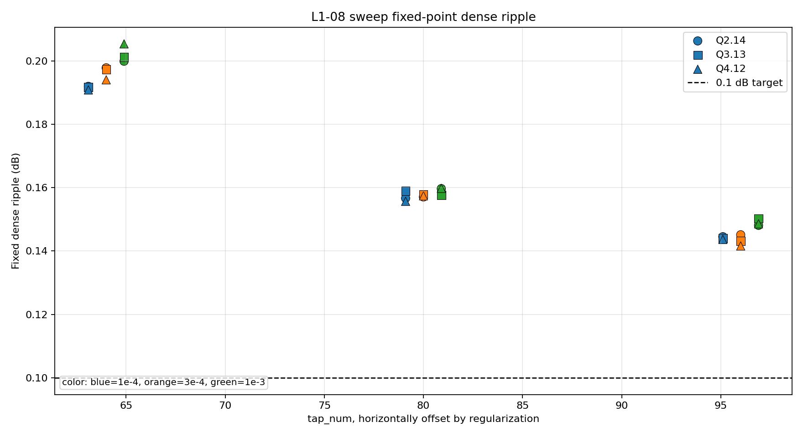
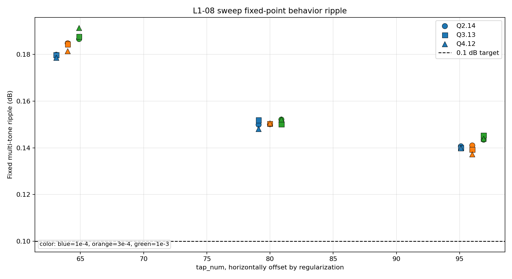
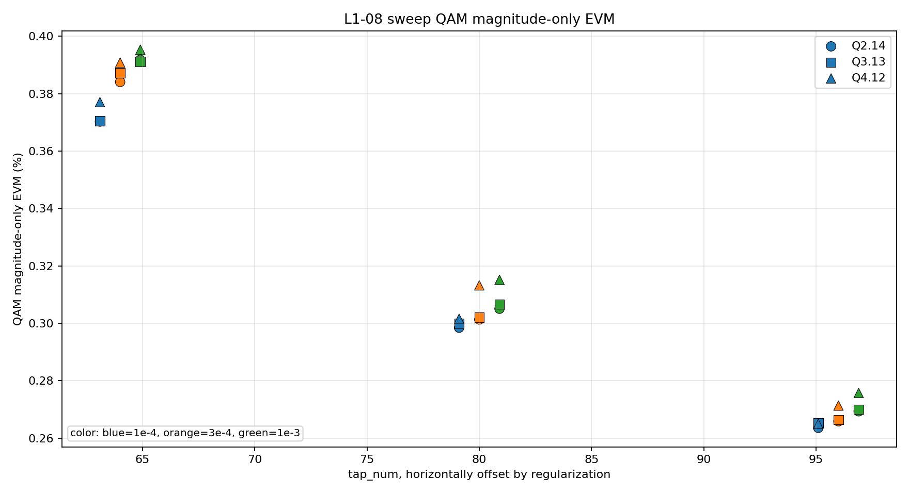
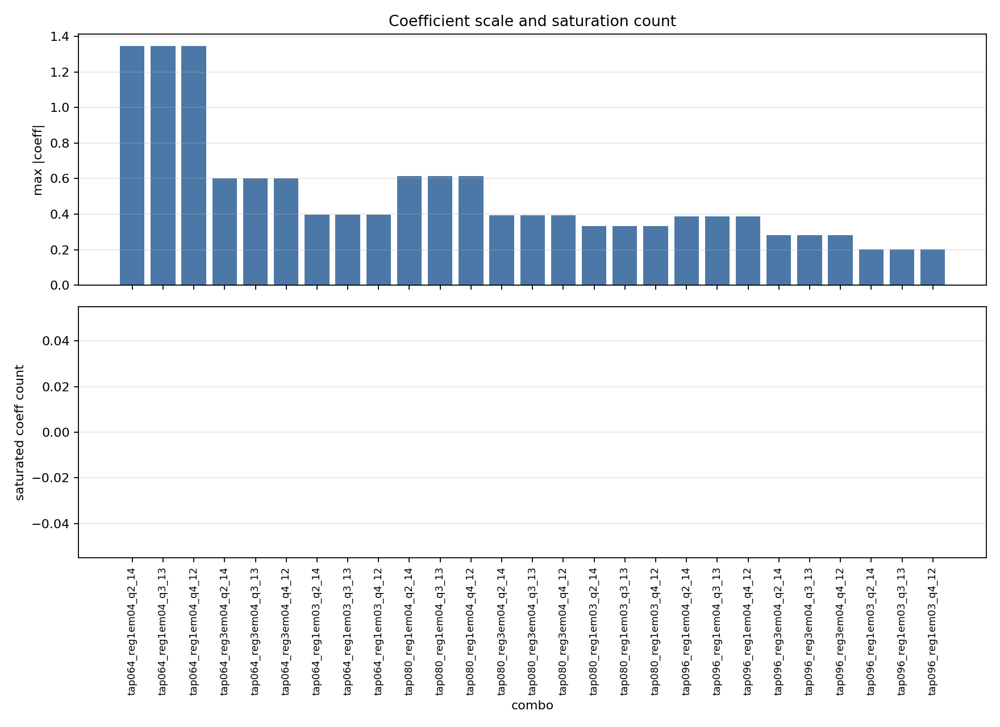

# L1-08 Sweep Analysis Report

## 1. Scope

This report summarizes one completed L1-08 parameter sweep from `sweep_summary.csv`.

- Total combos: `27`
- tap_num values: `64, 80, 96`
- regularization values: `0.0001, 0.0003, 0.001`
- fixed-point formats: `Q2.14, Q3.13, Q4.12`
- H1 ripple before compensation: `0.758438 dB`
- Ripple pass target used in this report: `0.100000 dB`

## 2. Overall Result

- Fixed dense ripple pass count: `0 / 27`
- Fixed multi-tone behavior pass count: `0 / 27`
- Saturated combo count: `0 / 27`

## 3. Best Combos

| Criterion | Combo | Dense ripple (dB) | Behavior ripple (dB) | QAM mag-only EVM (%) | Saturation |
|---|---|---:|---:|---:|---:|
| best_fixed_dense | `tap096_reg3em04_q4_12` | 0.141577 | 0.137203 | 0.271331 | 0 |
| best_fixed_dense_unsaturated | `tap096_reg3em04_q4_12` | 0.141577 | 0.137203 | 0.271331 | 0 |
| best_behavior_fixed | `tap096_reg3em04_q4_12` | 0.141577 | 0.137203 | 0.271331 | 0 |
| best_behavior_fixed_unsaturated | `tap096_reg3em04_q4_12` | 0.141577 | 0.137203 | 0.271331 | 0 |
| best_qam_fixed | `tap096_reg1em04_q2_14` | 0.144507 | 0.140658 | 0.263562 | 0 |
| best_qam_fixed_unsaturated | `tap096_reg1em04_q2_14` | 0.144507 | 0.140658 | 0.263562 | 0 |
| lowest_tap_dense_pass | `tap064_reg1em04_q4_12` | 0.190805 | 0.178577 | 0.377055 | 0 |
| lowest_tap_behavior_pass | `tap064_reg1em04_q4_12` | 0.190805 | 0.178577 | 0.377055 | 0 |

## 4. Group Summary

### By Tap

| Group | Combos | Dense pass | Behavior pass | Saturated | Best dense (dB) | Best behavior (dB) | Best QAM mag EVM (%) |
|---|---:|---:|---:|---:|---:|---:|---:|
| 64 | 9 | 0 | 0 | 0 | 0.190805 | 0.178577 | 0.370280 |
| 80 | 9 | 0 | 0 | 0 | 0.155662 | 0.148058 | 0.298456 |
| 96 | 9 | 0 | 0 | 0 | 0.141577 | 0.137203 | 0.263562 |

### By Regularization

| Group | Combos | Dense pass | Behavior pass | Saturated | Best dense (dB) | Best behavior (dB) | Best QAM mag EVM (%) |
|---|---:|---:|---:|---:|---:|---:|---:|
| 0.0001 | 9 | 0 | 0 | 0 | 0.143632 | 0.139786 | 0.263562 |
| 0.0003 | 9 | 0 | 0 | 0 | 0.141577 | 0.137203 | 0.265876 |
| 0.001 | 9 | 0 | 0 | 0 | 0.148088 | 0.143491 | 0.269352 |

### By Fixed-Point Format

| Group | Combos | Dense pass | Behavior pass | Saturated | Best dense (dB) | Best behavior (dB) | Best QAM mag EVM (%) |
|---|---:|---:|---:|---:|---:|---:|---:|
| Q2.14 | 9 | 0 | 0 | 0 | 0.144507 | 0.140658 | 0.263562 |
| Q3.13 | 9 | 0 | 0 | 0 | 0.143177 | 0.139188 | 0.265227 |
| Q4.12 | 9 | 0 | 0 | 0 | 0.141577 | 0.137203 | 0.264973 |

## 5. Interpretation

- tap_num `64, 80, 96` did not pass dense `0.1 dB` in this sweep. It is not a robust choice for this H1 seed.
- Lowest-tap dense-pass candidate: `tap064_reg1em04_q4_12` with fixed dense ripple `0.190805 dB` and QAM magnitude-only EVM `0.377055%`.
- Best unsaturated QAM magnitude-only EVM candidate: `tap096_reg1em04_q2_14` with `0.263562%`.
- Dense ripple should be treated as the stricter pass/fail metric because multi-tone verification samples only selected frequencies and may miss the worst point in the full H1 grid.

## 6. Generated Files

- Best combo table: `sweep_best_combos.csv`
- Group summary table: `sweep_group_summary.csv`
- Plot: `sweep_fixed_dense_ripple_by_tap.png`
- Plot: `sweep_behavior_ripple_by_tap.png`
- Plot: `sweep_qam_evm_by_tap.png`
- Plot: `sweep_saturation_and_coeff_range.png`

## 7. Plots

